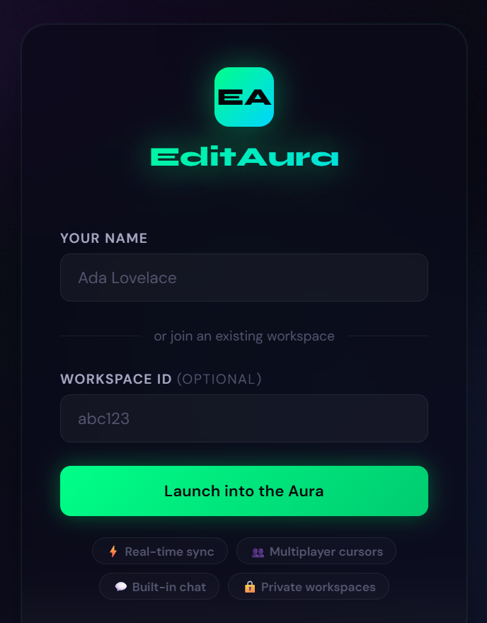
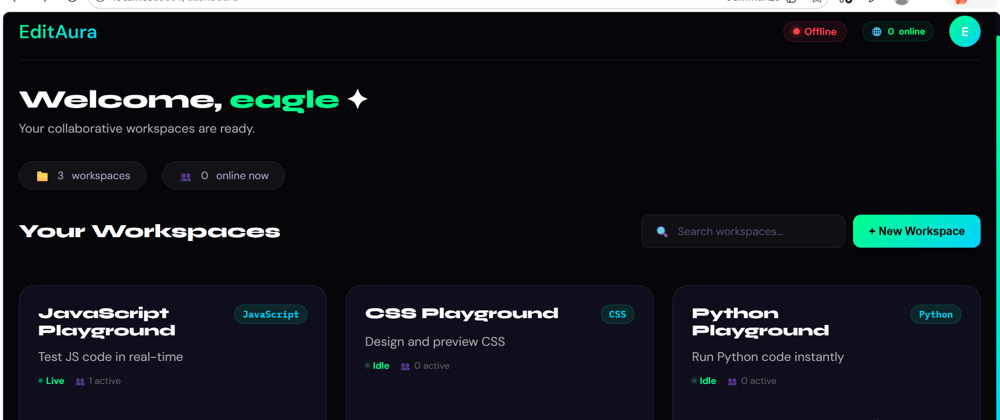

# ✨ EditAura - Collaborative Code Editor


> **Real-time collaborative code editor with built-in chat.** Code together with your team instantly, run code in multiple languages, and collaborate seamlessly from anywhere.

[](https://editaura.onrender.com)
[](https://github.com/Nehacoder-14/editaura)

---

## 📸 Screenshots

<div align="center">
  
### 🚪 Signup Page


### 📊 Dashboard - Workspace Management


### 💻 Collaborative Code Editor


### 💬 Real-time Chat & Collaboration


### ▶️ Code Execution Output


### 👥 Live User Presence


</div>

> **Note:** Add your screenshots to the `screenshots/` folder. Remove the `(coming soon)` placeholders after adding actual images.

---

## ✨ Features

| Feature | Description |
|---------|-------------|
| 🔐 **User Authentication** | Simple username-based login system |
| 💬 **Real-time Chat** | Built-in chat for team communication |
| 👥 **Live Presence** | See who's online in your workspace |
| ⌨️ **Collaborative Editing** | Code syncs in real-time across all users |
| ▶️ **Code Execution** | Run JavaScript & Python code instantly |
| 🎨 **CSS Playground** | Live CSS styling and preview |
| 💾 **Auto-save** | Code automatically saved to database |
| 🔗 **Share Links** | Invite teammates with unique workspace links |
| 📱 **Responsive Design** | Works on desktop, tablet, and mobile |

---

## 🛠️ Tech Stack

<div align="center">

| Category | Technologies |
|----------|-------------|
| **Backend** | Node.js, Express.js, Socket.IO |
| **Frontend** | HTML5, CSS3, Vanilla JavaScript |
| **Real-time** | WebSockets (Socket.IO) |
| **Database** | JSON file-based storage |
| **Code Execution** | Python (subprocess), JavaScript (eval) |

</div>

---

## 🚀 Quick Start

### Prerequisites

- Node.js (v14 or higher)
- npm or yarn
- Python (optional - for Python code execution)

### Installation

1. **Clone the repository**
   ```bash
   git clone https://github.com/Nehacoder-14/editaura.git
   cd editaura